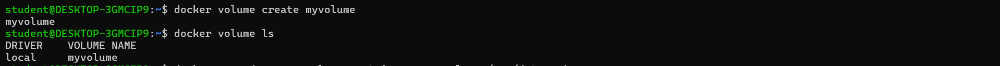
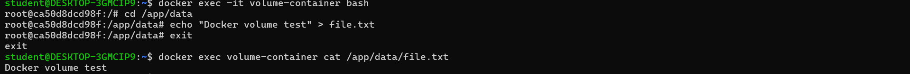
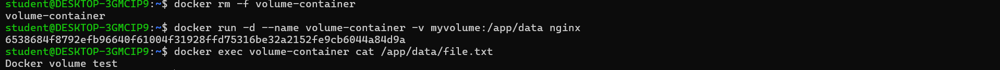
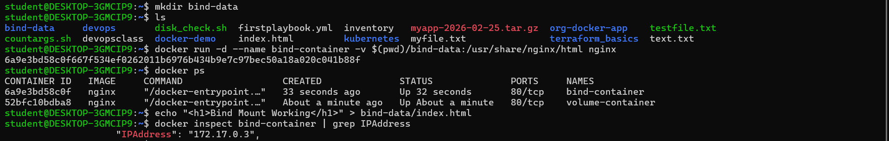
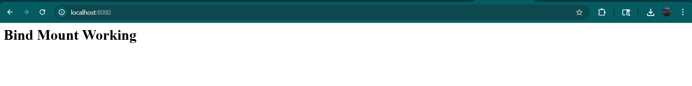
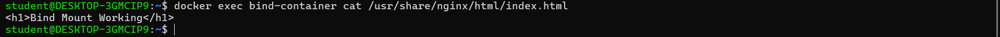
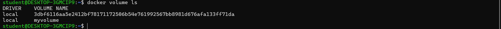
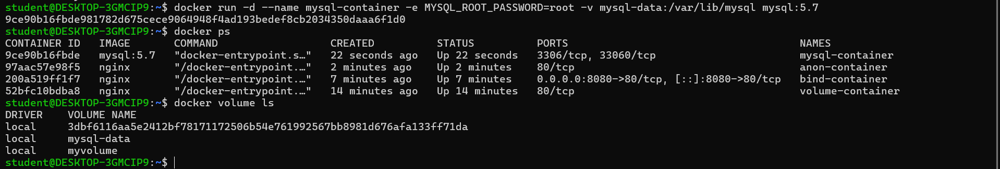
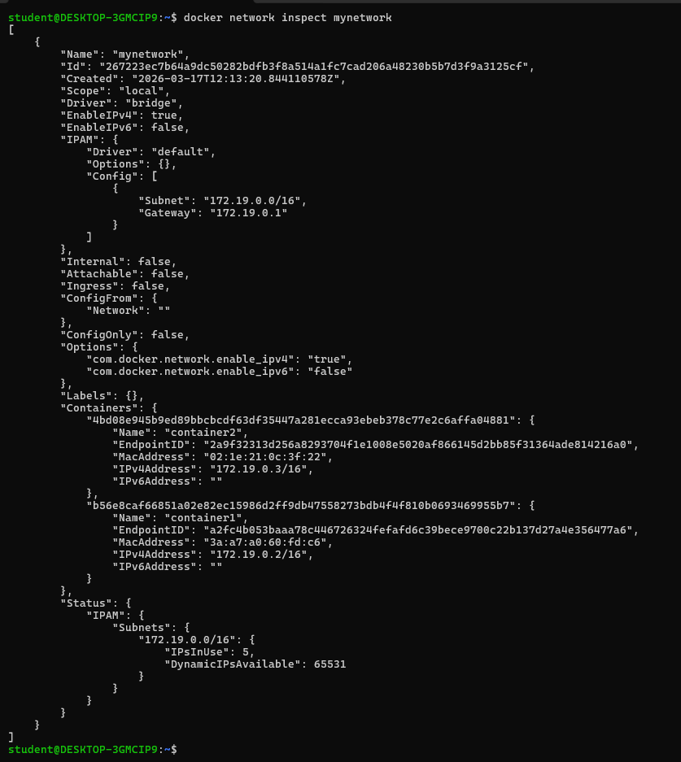

Docker Day 4 – Volumes and Networking
 Objective

The objective of this task is to understand:

Docker volumes for persistent storage

Docker networking for communication between containers

 Prerequisites

Docker installed on your system

Basic knowledge of Docker commands

1️⃣ Named Volume
🔹 What is a Named Volume?

Named volumes are managed by Docker and stored in Docker’s internal storage.
They help persist data even after a container is deleted.

🔹 Create a Docker Volume
docker volume create myvolume

📸 Screenshot:

🔹 Run Container Using Volume
docker run -d --name volume-container -v myvolume:/app/data nginx

📸 Screenshot:

🔹 Add Data Inside Container
docker exec -it volume-container bash
cd /app/data
echo "Docker Volume Test" > file.txt

📸 Screenshot:

🔹 Verify Data Persistence
docker rm -f volume-container

docker run -d --name volume-container -v myvolume:/app/data nginx

docker exec -it volume-container cat /app/data/file.txt

📸 Screenshot:

2️⃣ Bind Mount
🔹 What is a Bind Mount?

Bind mounts map a directory from the host machine to the container.
Any changes made on the host are instantly reflected inside the container.

🔹 Create Directory on Host
mkdir bind-data
🔹 Run Container with Bind Mount
docker run -d --name bind-container -p 8080:80 -v $(pwd)/bind-data:/usr/share/nginx/html nginx

👉 Here:

$(pwd)/bind-data → Host directory

/usr/share/nginx/html → Container directory

📸 Screenshot:

🔹 Create Webpage from Host
echo "<h1>Bind Mount Working</h1>" > bind-data/index.html

📸 Screenshot:

🔹 Output (Access in Browser)

Open in browser:

http://localhost:8080

📸 Screenshot:

3️⃣ Anonymous Volume
🔹 What is an Anonymous Volume?

Anonymous volumes are created automatically by Docker without a name.
They are useful for temporary data storage.

🔹 Run Container with Anonymous Volume
docker run -d --name anon-container -v /app/data nginx

📸 Screenshot:

4️⃣ Persist Database Data Using Volume
🔹 Run MySQL Container with Volume
docker run -d \
--name mysql-container \
-e MYSQL_ROOT_PASSWORD=root \
-v mysql-data:/var/lib/mysql \
mysql:5.7

👉 This ensures database data is not lost even if the container is removed.

📸 Screenshot:

5️⃣ Create Custom Docker Network
🔹 What is a Docker Network?

Docker networks allow containers to communicate with each other.

🔹 Create Network
docker network create mynetwork

📸 Screenshot:

6️⃣ Connect Multiple Containers
🔹 Run Containers in Same Network
docker run -dit --name container1 --network mynetwork nginx
docker run -dit --name container2 --network mynetwork busybox

📸 Screenshot:

🔹 Test Communication Between Containers
docker exec -it container2 sh
ping container1

👉 Containers in the same network can communicate using container names as hostnames.

7️⃣ Inspect Docker Network
🔹 Inspect Network Details
docker network inspect mynetwork

📸 Screenshot:

✅ Conclusion

In this task, we successfully implemented:

Named Volumes for persistent storage

Bind Mounts for real-time host-container data sharing

Anonymous Volumes for temporary storage

Database persistence using Docker volumes

Custom Docker networks

Container-to-container communication

Docker network inspection